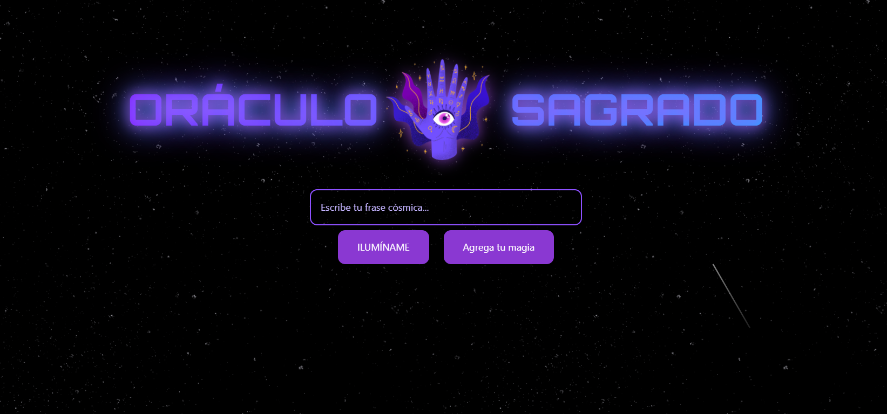

# Oráculo Sagrado

Aplicación web interactiva que muestra frases cósmicas aleatorias y permite agregar nuevas. Incluye fondo estrellado animado, estrellas fugaces y efectos de texto con BlurText.

## Captura



## Tecnologías

- React + TypeScript (Vite)
- Tailwind CSS
- Supabase (base de datos)
- React Router
- Vitest + Testing Library (tests)

## Estructura rápida

- `src/App.tsx`: pantalla principal (ILUMÍNAME, agregar frase, revelación con BlurText)
- `src/FrasesPage.tsx`: listado + borrado de frases guardadas
- `src/BlurText.tsx`: animación por palabras/letras con blur + slide
- `src/index.css`: fondo estrellado y animaciones (estrellas, twinkling, fugaces)
- `public/`: imágenes (`ojo.png`, `ojodios.png`, `ojo-mano.png`, `oraculo.png`)

## Requisitos

- Node 18+ (recomendado 20)
- Cuenta de Supabase (o ajusta el cliente a otro backend)

## Instalación

1) Instalar dependencias

```
npm install
```

2) Variables de entorno (`.env`)

```
VITE_SUPABASE_URL=https://<tu-proyecto>.supabase.co
VITE_SUPABASE_ANON_KEY=<tu_anon_key>
```

3) Base de datos (tabla mínima)

En Supabase, crea la tabla `frases`:

```
create table if not exists public.frases (
  id uuid primary key default gen_random_uuid(),
  texto text not null
);
```

4) Desarrollo

```
npm run dev
```

## Uso

- ILUMÍNAME: muestra una frase aleatoria de la tabla `frases`.
- Agrega tu magia: inserta una nueva frase.
- Ver frases: navega a `/frases` para listar y borrar.

Nota: el botón “Ver frases” está en la esquina inferior derecha.

## Tests

- Ejecutar en modo CI:

```
npm run test
```

- Modo watch:

```
npm run test:watch
```

Incluye mocks de `IntersectionObserver` y `requestAnimationFrame` para testear `BlurText`.

## Personalización

- Estrellas fugaces: variables `--distance`, `--duration` y `--angle` en `src/index.css`.
- Velocidad/frecuencia de meteoros: intervalo en `App.tsx` (hook de estrellas fugaces).
- Animación de texto: props de `BlurText` (`animateBy`, `delay`, `stepDuration`, `direction`).

## Deploy

Build de producción:

```
npm run build
```

Sirve el contenido de `dist/` (Netlify, Vercel, etc.). Si usas subruta, Vite maneja `BASE_URL` automáticamente.

## Licencia

MIT © 2025

